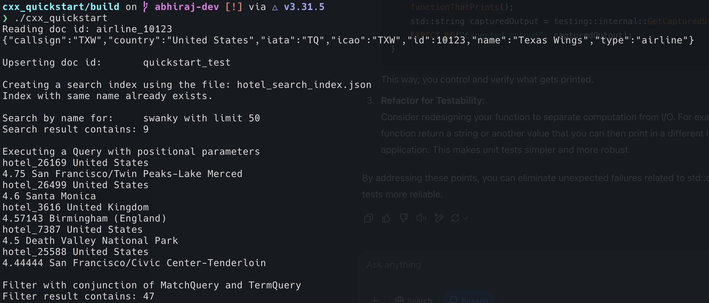

# Quickstart in Couchbase with C++

#### Overview
This repository provides a simple guide to get started with integrating Couchbase with a C++ application. It is designed to give you a starter project in order to give you an idea about how to start working with the Couchbase [C++ SDK](https://github.com/couchbase/couchbase-cxx-client). 

<details>
<summary>More Info</summary>
Following topics are 
1. How to create, read, update, and delete documents using [Key Value operations](https://docs.couchbase.com/python-sdk/current/howtos/kv-operations.html) (KV operations). KV operations are unique to couchbase and provide super fast (think microseconds) queries.

2. How to write simple parametrized [SQL++ queries](https://docs.couchbase.com/python-sdk/current/howtos/n1ql-queries-with-sdk.html) using the built-in travel-sample bucket.

3. How to create and use [Search indexes](https://docs.couchbase.com/server/current/search/search.html#indexes) for near real-time search capabilities for a diverse range of data types.

Full documentation for the tutorial can be found on the [Couchbase Developer Portal]().
</details>


## Prerequisites

To run this prebuilt project, you will need:

- [Couchbase Capella](https://www.couchbase.com/products/capella/) cluster or a self managed Couchbase cluster with [travel-sample](https://docs.couchbase.com/python-sdk/current/ref/travel-app-data-model.html) bucket loaded.
  - To run this tutorial using a self managed Couchbase cluster, please refer to this [section](##Running-Self-Managed-Couchbase-Cluster).

- [CMake](https://cmake.org/) 3.9 or higher installed
- [C++17](https://en.cppreference.com/w/cpp/17) and a compatible compiler, [clang++](https://clang.llvm.org/) or [g++](https://gcc.gnu.org/)
- Loading Travel Sample Bucket
  If travel-sample is not loaded in your cluster, you can load it by following the instructions:
  - [Load travel-sample bucket in Couchbase Capella](https://docs.couchbase.com/cloud/clusters/data-service/import-data-documents.html#import-sample-data)
  - [Load travel-sample bucket in self-managed cluster](https://docs.couchbase.com/server/current/getting-started/do-a-quick-install.html#load-the-sample-dataset)

## Application Setup

We will walk through the different steps required to get the application running.

### Cloning Repo

```sh
git clone https://github.com/couchbase-examples/cxx-quickstart.git
```


### Setup Database Configuration

To know more about connecting to your Capella cluster, please follow the [instructions](https://docs.couchbase.com/cloud/get-started/connect.html).

Specifically, you need to do the following:

- Create the [database credentials](https://docs.couchbase.com/cloud/clusters/manage-database-users.html) to access the travel-sample bucket (Read and Write) used in the application.
- [Allow access](https://docs.couchbase.com/cloud/clusters/allow-ip-address.html) to the Cluster from the IP on which the application is running.

All configuration for communication with the database is read from the environment variables. We have provided a convenience feature in this quickstart to setup the required environment variables using a shell script `setup_env_vars.sh`. Change the values of the following lines:

```sh
export DB_CONN_STR=<connection_string>
export DB_USERNAME=<username>
export DB_PASSWORD=<password>
export BUCKET_NAME=<bucket_name>
export SCOPE_NAME=<inventory>
export COL_NAME=<collection_name>
```
> Note: The connection string expects the `couchbases://` or `couchbase://` part.

Run the command:
```sh
source setup_env_vars.sh
```
This will set the environment variables for that session.

### Install Dependencies and Building

This project makes use of CMake and CPM to install dependencies. 


```sh
mkdir build
cd build
cmake ..
cmake --build .
```

This will download and install all the dependencies required for the project to built. Along with that it will build the executable required to run the application.

## Running The Application

### Directly on Machine

At this point, we have installed the dependencies, loaded the travel-sample data and configured the application with the credentials. The application is now ready and you can run it by executing the following command from the build directory:

```sh
./cxx_quickstart_ex
```


### Verifying the Application

Once you run the executable, your terminal should fill up with the results of the executed statements written in the main function of the `main.cpp` and should look something like this:


### Running Self Managed Couchbase Cluster

If you are running this quickstart with a self managed Couchbase cluster, you need to [load](https://docs.couchbase.com/server/current/manage/manage-settings/install-sample-buckets.html) the travel-sample data bucket in your cluster and generate the credentials for the bucket.

You need to update the connection string and the credentials in the `set_env_vars.sh` file in the source folder and run `source set_env_vars.sh` to set them.


### Running Tests

For running tests, a self-managed cluster is required with travel-sample bucket loaded or you need to update the connection details in the `tests/test.cpp` file. To run the tests, use the following command from the build directory:

```sh
./tests/u_tests
```

### Data Model

For this quickstart, we use one collection, `airline`  and `hotels` collection that contains sample airline and sample hotel information. For CRUD operations, we make use of the `airline` collection, whereas for Search indexes and Query execution we use the `hotel`collection.
You can find the schema for both these collections in the model folder.
